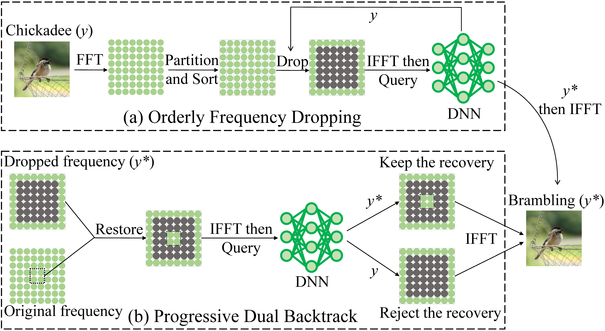

# A Few Seconds Can Change Everything: Fast Decision-based Attacks against DNNs




Above is an overview of our method. For details, read [our paper](https://www.ijcai.org/proceedings/2022/464).

***


**Abstract** 

***

Previous researches have demonstrated deep learning models' vulnerabilities to decision-based adversarial attacks, which craft adversarial examples based solely on information from output decisions (top-1 labels). However, existing decision-based attacks have two major limitations, i.e., expensive query cost and being easy to detect. To bridge the gap and enlarge real threats to commercial applications, we propose a novel and efficient decision-based attack against black-box models, dubbed FastDrop, which only requires a few queries and work well under strong defenses. The crux of the innovation is that, unlike existing adversarial attacks that rely on gradient estimation and additive noise, FastDrop generates adversarial examples by dropping information in the frequency domain. Extensive experiments on three datasets demonstrate that FastDrop can escape the detection of the state-of-the-art (SOTA) black-box defenses and reduce the number of queries by 13$\sim$133× under the same level of perturbations compared with the SOTA attacks. FastDrop only needs 10$\sim$20 queries to conduct an attack against various black-box models within 1s. Besides, on commercial vision APIs provided by Baidu and Tencent, FastDrop achieves an attack success rate (ASR) of 100% with 10 queries on average, which poses a real and severe threat to real-world applications.


**Citation**

***

> ```
> @inproceedings{DBLP:conf/ijcai/MouZWGG22,
>   author    = {Ningping Mou and
>                Baolin Zheng and
>                Qian Wang and
>                Yunjie Ge and
>                Binqing Guo},
>   title     = {A Few Seconds Can Change Everything: Fast Decision-based Attacks against
>                DNNs},
>   booktitle = {Proceedings of the Thirty-First International Joint Conference on
>                Artificial Intelligence, {IJCAI} 2022, Vienna, Austria, 23-29 July
>                2022},
>   year      = {2022}
> }
> ```